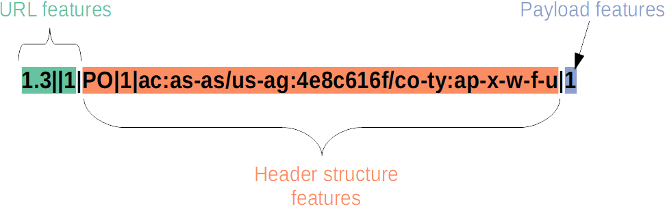

# Hfinger - fingerprinting HTTP requests
Tool for fingerprinting HTTP requests of malware. Based on Tshark and written in Python3. Working prototype stage :-)

It's main objective is to provide a representation of malware requests in a shorter form than printing whole 
request, but still human interpretable. This representation should be unique between malware families, 
what means that any fingerprint should be seen only for one particular family.

An academic paper accompanies work on this tool, describing, for example, motivation of design choices. 
It will be published here after peer-review process.
## The idea
Basic assumption of this project is that HTTP requests of different malware families are more or less unique, 
so they can be fingerprinted to provide some sort of identification. Hfinger retains information about structure and 
values of some headers to provide means for further analysis. 
For example grouping of similar requests - at this moment it is still work in progress.

After analysis of malware's HTTP requests and headers, some parts of requests were identified as being most distinctive. These include:
* Request method
* Protocol version
* Header order
* Popular headers' values
* Payload length, entropy and presence of non-ASCII characters

Additionally, some standard features of request URL were also considered. 
All these parts were translated into set of features, described in details [here](./docs/feature_description.md).

The above features are translated into varying length representation, which is the actual fingerprint. 
Depending on report mode, different features are used to fingerprint requests. More information on these modes 
is presented below. Feature selection process will be described in the upcoming academic paper.

## Installation
At this moment `hfinger` is distributed only via this repository. 
`Tshark` required before installation - tested on Xubuntu 20.04 LTS with `tshark` package in version `3.2.3`.

Please note, that as with any PoC, you should run it in a python virtual environment. Its setup is not covered here, 
but you can try [this tutorial](https://docs.python.org/3/library/venv.html).

`Hfinger` installation:
1. Download repository.
2. Unpack it to a chosen location.
3. In terminal, change directory to the main catalogue of the unpacked repo.
4. Enable `venv`
5. Run `python3 setup.py install`
6. `Hfinger` should be installed and ready to use.


## Usage
Calling the tool from a command line:
```
usage: hfinger.py [-h] (-f FILE | -d DIR) [-o output_path] [-m {0,1,2}]

Hfinger - fingerprinting HTTP requests stored in pcap files

optional arguments:
  -h, --help            show this help message and exit
  -f FILE, --file FILE  Read single pcap file
  -d DIR, --directory DIR
                        Read pcap files from directory DIR
  -o output_path, --output-path output_path
                        Path to the output directory
  -m {0,1,2}, --mode {0,1,2}
                        Fingerprint report mode. 0 - optimal (default), 1 -
                        informative, 2 - all features

```
You must provide path to a pcap file (-f) or directory (-d) with pcap files. The output is in JSON format.
It will be printed to standard output or to provided directory (-o) using name of the source file. 
For example output of the command:

`python3 hfinger.py -f example.pcap -o /tmp/pcap`

will be saved to: 

`/tmp/pcap/example.pcap.json`

When any issues are encountered, for example finding unknown header, they are printed to standard error output, 
so please monitor it.

## Fingerprint creation
An example of a `POST` request is presented below.
```
POST /dir1/dir2?var1=val1 HTTP/1.1
Host: 127.0.0.1:8000
Accept: */*
User-Agent: My UA
Content-Length: 9
Content-Type: application/x-www-form-urlencoded

misc=test
```

The fingerprint created by `hfinger` in the default report mode for this request is presented below. 
Particular features of the fingerprint are separated using `|`. They are described below in the order of appearance in the fingerprint.



Firstly URL features are extracted: 
* URL length represented as a logarithm base 10 of the length, 
* extension of the requested file, but only if it is on a list of known extensions in `hfinger/configs/extensions.txt`
 (in the example it is empty as the request does not contain it), 
* number of variables in the URL (in the example there as only one variable `var1`).

Secondly header structure features are analyzed: 
* request method encoded as first two letters of the method (`PO`), 
* protocol version encoded as an integer (_1_ for version _1.1_, _0_ for version _1.0_, and _9_ for version _0.9_), 
* and popular headers and their values, 

When analyzing popular headers, the request is checked if they appear in it. These headers are:
* Connection
* Accept-Encoding
* Content-Encoding
* Cache-Control
* TE
* Accept-Charset
* Content-Type
* Accept
* Accept-Language
* User-Agent

When header is found in the request, its value is checked against table of 
typical values to create pairs of `header_name_representation:value_representation`. The name of the header is encoded according to 
`hfinger/configs/headerslow.json` and value is encoded according to tables stored in `hfinger/configs` directory. In the above example
`Accept` is encoded as `ac` and its value `*/*` as `as-as` (`asterisk-asterisk`), giving `ac:as-as`. 
The pairs are inserted into fingerprint in order of appearance in the request and are delimited using `/`. 
If the header value cannot be found in in the encoding table it is hashed using 
[FNV1a hash](https://en.wikipedia.org/wiki/Fowler%E2%80%93Noll%E2%80%93Vo_hash_function).  
Also if it is composed of multiple values, they are tokenized to provide list of values delimited with `,`, 
for example `Accept: */*, text/*` would give `ac:as-as,te-as`. However, at this point of development, if the header 
value contain "quality value" tag (`q=`), then the whole value is hashed with FNV.
Finally values of *User-Agent* and *Accept-Language* headers are directly hashed using FNV. 

Some of the `hfinger` report modes provide a list of headers in order of appearance in the request. 
The list is created using similar method as described above. The header names are encoded using 
`hfinger/configs/headerslow.json` and separated with `,`. If the header name does not start with upper case letter
(or any of its parts when analyzing compound headers such as `Accept-Encoding`), 
then encoded representation is prefixed with `!`. If the header name is not on the list of known headers it is hashed using FNV. 


Finally, in the payload features, length of the payload is represented as a base 10 logarithm of the actual payload length rounded to an integer.

Please note that the above description of fingerprint creation covers the default feature set. 
`Hfinger` is equipped with other feature sets, which can be chosen depending on the required amount of information. 
They are available via report modes switch.

## Report modes

`Hfinger` operates in three fingerprint report modes, which differ in information extracted from requests:
* optimal,
* informative,
* all features.

The modes were chosen in order to optimize `hfinger` capabilities to uniquely identify malware families
versus its capability to generalize information about the requests. Description of features is provided 
[here](./docs/feature_description.md). The `all features` mode provide the most unique fingerprints, 
however it produces bigger number of fingerprints than other two modes. 
The `optimal` mode provides slightly less unique fingerprints, but also significantly reduces the number of fingerprints.
The `informative` mode is similar to `optimal` regarding uniqueness, however it produces more fingerprints 
for the price of giving more information about URL, headers and payload.

The modes consists of feature sets:
* optimal (the default - option _0_):
  * URL length represented as a base 10 logarithm of the actual length, 
  * extension of the requested file, 
  * number of variables in the URL,
  * request method, 
  * protocol version, 
  * popular headers and their values, 
  * payload length represented a base 10 logarithm of the actual length rounded to integer,
* informative (option _1_): 
  * URL length represented as a base 10 logarithm of the actual length, 
  * number of directories in the URL, 
  * extension of the requested file, 
  * number of variables in the URL, 
  * request method, 
  * protocol version, 
  * order of headers, 
  * popular headers and their values, 
  * payload length represented a base 10 logarithm of the actual length rounded to integer, 
  * and payload entropy represented as an integer,
* all features (option _2_): 
  * URL length represented as a base 10 logarithm of the actual length, 
  * number of directories in the URL, 
  * average length of directory in the URL, represented as a base 10 logarithm of actual average length, 
  * extension of the requested file, 
  * length of the variable part of the URL, represented as a base 10 logarithm of the length and rounded to an integer, 
  * number of variables in the URL, 
  * average value length, represented as base 10 logarithm of the actual average value length rounded to an integer, 
  * request method, 
  * protocol version, 
  * order of headers, 
  * popular headers and their values, 
  * presence of non-ASCII characters (with "N" when such characters are present and "A" when they are not),
  * payload length represented a base 10 logarithm of the actual length, 
  * payload entropy.


