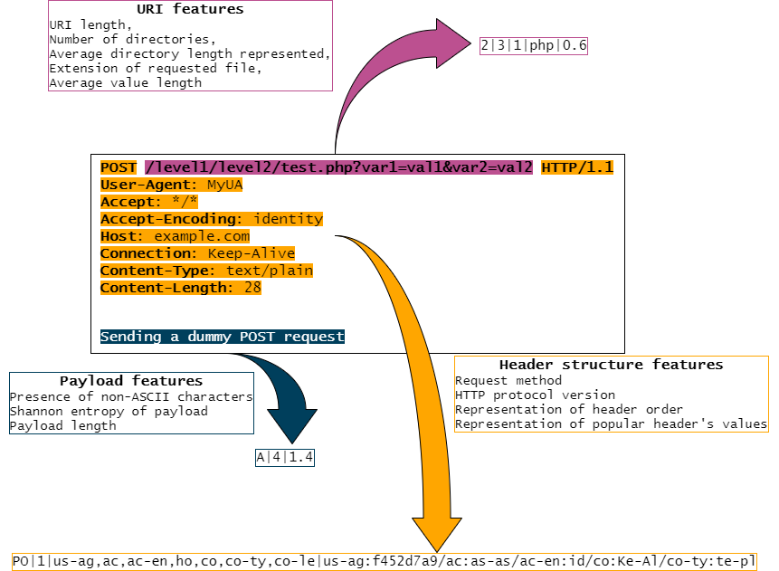

# Hfinger - fingerprinting malware HTTP requests
Tool for fingerprinting HTTP requests of malware. Based on Tshark and written in Python3. Working prototype stage :-)

Its main objective is to provide unique representations (fingerprints) of malware requests, 
which help in their identification. _Unique_ means here that each fingerprint should be seen only 
in one particular malware family, yet one family can have multiple fingerprints. Hfinger
represents the request in a shorter form than printing the whole request, but still human interpretable.

Hfinger can be used in manual malware analysis but also in sandbox systems or SIEMs. 
The generated fingerprints are useful for grouping requests, pinpointing requests to particular malware families,
identifying different operations of one family, 
or discovering unknown malicious requests omitted by other security systems but which share fingerprint.

An academic paper accompanies work on this tool, describing, for example, the motivation of design choices. 
It will be published here after the peer-review process.

## Table of contents
1. [The idea](#the-idea)
1. [Installation](#installation)
1. [Usage](#usage)
1. [Fingerprint creation](#fingerprint-creation)
1. [Report modes](#report-modes)

## The idea
The basic assumption of this project is that HTTP requests of different malware families are more or less unique, 
so they can be fingerprinted to provide some sort of identification. Hfinger retains information about the structure and 
values of some headers to provide means for further analysis. 
For example, grouping of similar requests - at this moment, it is still a work in progress.

After analysis of malware's HTTP requests and headers, we have identified some parts of requests as being most distinctive. 
These include:
* Request method
* Protocol version
* Header order
* Popular headers' values
* Payload length, entropy, and presence of non-ASCII characters

Additionally, some standard features of the request URL were also considered. 
All these parts were translated into a set of features, described in details [here](./docs/feature_description.md).

The above features are translated into varying length representation, which is the actual fingerprint. 
Depending on report mode, different features are used to fingerprint requests. More information on these modes 
is presented below. The feature selection process will be described in the forthcoming academic paper.

## Installation
Minimum requirements needed before installation:
* `Python` >= 3.3, 
* `Tshark` >= 2.2.0.

Installation available from PyPI:

`pip install hfinger`

Hfinger has been tested on Xubuntu 20.04 LTS with `tshark` package in version `3.2.3`, 
but should work with version `2.6.10` on Ubuntu 18.04.

Please note that as with any PoC, you should run Hfinger in a separated environment, 
at least with Python virtual environment. Its setup is not covered here, 
but you can try [this tutorial](https://docs.python.org/3/library/venv.html).

## Usage
After installation, you can call the tool directly from a command line with `hfinger` 
or as a Python module with `python -m hfinger`.

For example:

```console
foo@bar:~$ hfinger -f /tmp/test.pcap
[{"epoch_time": "1614098832.205385000", "ip_src": "127.0.0.1", "ip_dst": "127.0.0.1", "port_src": "53664", "port_dst": "8080", "fingerprint": "2|3|1|php|0.6|PO|1|us-ag,ac,ac-en,ho,co,co-ty,co-le|us-ag:f452d7a9/ac:as-as/ac-en:id/co:Ke-Al/co-ty:te-pl|A|4|1.4"}]
```

Help can be displayed with short `-h` or long `--help` switches:
```
usage: hfinger [-h] (-f FILE | -d DIR) [-o output_path] [-m {0,1,2,3,4}] [-v]
               [-l LOGFILE]

Hfinger - fingerprinting malware HTTP requests stored in pcap files

optional arguments:
  -h, --help            show this help message and exit
  -f FILE, --file FILE  Read a single pcap file
  -d DIR, --directory DIR
                        Read pcap files from the directory DIR
  -o output_path, --output-path output_path
                        Path to the output directory
  -m {0,1,2,3,4}, --mode {0,1,2,3,4}
                        Fingerprint report mode. 
                        0 - similar number of collisions and fingerprints as mode 2, but using fewer features, 
                        1 - representation of all designed features, but a little more collisions than modes 0, 2, and 4, 
                        2 - optimal (the default mode), 
                        3 - the lowest number of generated fingerprints, but the highest number of collisions, 
                        4 - the highest fingerprint entropy, but slightly more fingerprints than modes 0-2
  -v, --verbose         Report information about non-standard values in the request 
                        (e.g., non-ASCII characters, no CRLF tags, values not present in the configuration list). 
                        Without --logfile (-l) will print to the standard error.
  -l LOGFILE, --logfile LOGFILE
                        Output logfile in the verbose mode. Implies -v or --verbose switch.

```
You must provide a path to a pcap file (-f), or a directory (-d) with pcap files. The output is in JSON format.
It will be printed to standard output or to the provided directory (-o) using the name of the source file. 
For example, output of the command:

`hfinger -f example.pcap -o /tmp/pcap`

will be saved to: 

`/tmp/pcap/example.pcap.json`

Report mode `-m`/`--mode` can be used to change the default report mode by providing an integer in the range `0-4`. 
The modes differ on represented request features or rounding modes. 
The default mode (`2`) was chosen by us to represent all features that are usually used during requests' analysis, 
but it also offers low number of collisions and generated fingerprints. 
With other modes, you can achieve different goals. 
For example, in mode `3` you get a lower number of generated fingerprints 
but a higher chance of a collision between malware families. If you are unsure, you don't have to change anything.
More information on report modes is [here](#report-modes).

Beginning with version `0.2.1` Hfinger is less verbose. You should use `-v`/`--verbose` if you want to receive 
information about encountered non-standard values of headers, non-ASCII characters in the non-payload part of 
the request, lack of CRLF tags (`\r\n\r\n`), and other problems with analyzed requests that are not application errors.
When any such issues are encountered in the verbose mode, they will be printed to the standard error output. 
You can also save the log to a defined location using `-l`/`--log` switch (it implies `-v`/`--verbose`). 
The log data will be appended to the log file.

### Using _hfinger_ in a Python application

Beginning with version `0.2.0`, Hfinger supports importing to other Python applications. 
To use it in your app simply import `hfinger_analyze` function from `hfinger.analysis` 
and call it with a path to the pcap file and reporting mode. 
The returned result is a list of dicts with fingerprinting results.

For example:

```python
from hfinger.analysis import hfinger_analyze

pcap_path = "SPECIFY_PCAP_PATH_HERE"
reporting_mode = 4
print(hfinger_analyze(pcap_path, reporting_mode))
```

Beginning with version `0.2.1` Hfinger uses `logging` module for logging information about encountered 
non-standard values of headers, non-ASCII characters in the non-payload part of the request, 
lack of CRLF tags (`\r\n\r\n`), and other problems with analyzed requests that are not application errors. 
Hfinger creates its own logger using name `hfinger`, but without prior configuration log information in practice is discarded.
If you want to receive this log information, before calling `hfinger_analyze`, you should configure `hfinger` logger, 
set log level to `logging.INFO`, configure log handler up to your needs, add it to the logger.
More information is available in the `hfinger_analyze` function docstring.

## Fingerprint creation
A fingerprint is based on features extracted from a request. 
Usage of particular features from [the full list](./docs/feature_description.md) depends on the chosen 
report mode from a predefined list (more information on report modes is [here](#report-modes)). 
The figure below represents the creation of an exemplary fingerprint in the default report mode.



Three parts of the request are analyzed to extract information: URI, 
headers' structure (including method and protocol version), and payload. 
Particular features of the fingerprint are separated using `|` (pipe). The final fingerprint generated for the `POST`
request from the example is:

`2|3|1|php|0.6|PO|1|us-ag,ac,ac-en,ho,co,co-ty,co-le|us-ag:f452d7a9/ac:as-as/ac-en:id/co:Ke-Al/co-ty:te-pl|A|4|1.4`

The creation of features is described below in the order of appearance in the fingerprint.

Firstly, URI features are extracted: 
* URI length represented as a logarithm base 10 of the length, rounded to an integer, 
  (in the example URI is 43 characters long, so `log10(43)≈2`),
* number of directories, (in the example there are 3 directories),
* average directory length, represented as a logarithm with base 10 of the actual 
  average length of the directory, rounded to an integer,
  (in the example there are three directories with total length of 20 characters (6+6+8), so `log10(20/3)≈1`),
* extension of the requested file, but only if it is on a list of known extensions in `hfinger/configs/extensions.txt`, 
* average value length represented as a logarithm with base 10 of the actual average value length, 
  rounded to one decimal point, (in the example two values have the same length of 4 characters, 
  what is obviously equal to 4 characters, and `log10(4)≈0.6`).

Secondly, header structure features are analyzed: 
* request method encoded as first two letters of the method (`PO`), 
* protocol version encoded as an integer (_1_ for version _1.1_, _0_ for version _1.0_, and _9_ for version _0.9_),
* order of the headers,
* and popular headers and their values. 

To represent order of the headers in the request, each header's name is encoded according to the schema in 
`hfinger/configs/headerslow.json`, for example, `User-Agent` header is encoded as `us-ag`. 
Encoded names are separated by `,`. If the header name does not start with an upper case letter
(or any of its parts when analyzing compound headers such as `Accept-Encoding`), 
then encoded representation is prefixed with `!`. 
If the header name is not on the list of the known headers, 
it is hashed using [FNV1a hash](https://en.wikipedia.org/wiki/Fowler%E2%80%93Noll%E2%80%93Vo_hash_function), 
and the hash is used as encoding. 


When analyzing popular headers, the request is checked if they appear in it. These headers are:
* Connection
* Accept-Encoding
* Content-Encoding
* Cache-Control
* TE
* Accept-Charset
* Content-Type
* Accept
* Accept-Language
* User-Agent

When the header is found in the request, its value is checked against a table of 
typical values to create pairs of `header_name_representation:value_representation`. 
The name of the header is encoded according to the schema in `hfinger/configs/headerslow.json` (as presented before),
and the value is encoded according to schema stored in `hfinger/configs` directory or `configs.py` file, 
depending on the header. In the above example `Accept` is encoded as `ac` 
and its value `*/*` as `as-as` (`asterisk-asterisk`), giving `ac:as-as`. 
The pairs are inserted into fingerprint in order of appearance in the request and are delimited using `/`. 
If the header value cannot be found in the encoding table, it is hashed using the FNV1a hash.  
If the header value is composed of multiple values, they are tokenized to provide a list of values delimited with `,`, 
for example, `Accept: */*, text/*` would give `ac:as-as,te-as`. However, at this point of development, if the header 
value contains a "quality value" tag (`q=`), then the whole value is encoded with its FNV1a hash.
Finally, values of *User-Agent* and *Accept-Language* headers are directly encoded using their FNV1a hashes. 

Finally, in the payload features:
* presence of non-ASCII characters, represented with the letter `N`, and with `A` otherwise,
* payload's Shannon entropy, rounded to an integer,
* and payload length, represented as a logarithm with base 10 of the actual payload length, 
  rounded to one decimal point.

## Report modes

`Hfinger` operates in five report modes, which differ in features represented in the fingerprint, thus 
information extracted from requests. These are (with the number used in the tool configuration):
* mode `0` - producing a similar number of collisions and fingerprints as mode `2`, but using fewer features,
* mode `1` - representing all designed features, but producing a little more collisions than modes `0`, `2`, and `4`,
* mode `2` - optimal (the default mode), representing all features which are usually used during requests' analysis, 
  but also offering a low number of collisions and generated fingerprints,
* mode `3` - producing the lowest number of generated fingerprints from all modes, 
  but achieving the highest number of collisions,
* mode `4` - offering the highest fingerprint entropy, 
  but also generating slightly more fingerprints than modes `0`-`2`.


The modes were chosen in order to optimize Hfinger's capabilities to uniquely identify malware families
versus the number of generated fingerprints. Modes `0`, `2`, and `4` offer a similar number of collisions 
between malware families, however, mode `4` generates a little more fingerprints than the other two. 
Mode `2` represents more request features than mode `0` with a comparable number of generated fingerprints and collisions.
Mode `1` is the only one representing all designed features, but it increases the number of collisions by almost two times 
comparing to modes `0`, `1`, and `4`. Mode `3` produces at least two times fewer fingerprints than other modes, but it 
introduces about nine times more collisions. Description of all designed features is [here](./docs/feature_description.md).

The modes consist of features (in the order of appearance in the fingerprint):
* mode `0`:
  * number of directories,
  * average directory length represented as an integer,
  * extension of the requested file,
  * average value length represented as a float,
  * order of headers,
  * popular headers and their values,
  * payload length represented as a float.
* mode `1`:
  * URI length represented as an integer,
  * number of directories,
  * average directory length represented as an integer,
  * extension of the requested file,
  * variable length represented as an integer,
  * number of variables,
  * average value length represented as an integer,
  * request method,
  * version of protocol,
  * order of headers,
  * popular headers and their values,
  * presence of non-ASCII characters,
  * payload entropy represented as an integer,
  * payload length represented as an integer.
* mode `2`:
  * URI length represented as an integer,
  * number of directories,
  * average directory length represented as an integer,
  * extension of the requested file,
  * average value length represented as a float,
  * request method,
  * version of protocol,
  * order of headers,
  * popular headers and their values,
  * presence of non-ASCII characters,
  * payload entropy represented as an integer,
  * payload length represented as a float.
* mode `3`:
  * URI length represented as an integer,
  * average directory length represented as an integer,
  * extension of the requested file,
  * average value length represented as an integer,
  * order of headers.
* mode `4`:
  * URI length represented as a float,
  * number of directories,
  * average directory length represented as a float,
  * extension of the requested file,
  * variable length represented as a float,
  * average value length represented as a float,
  * request method,
  * version of protocol,
  * order of headers,
  * popular headers and their values,
  * presence of non-ASCII characters,
  * payload entropy represented as a float,
  * payload length represented as a float.


